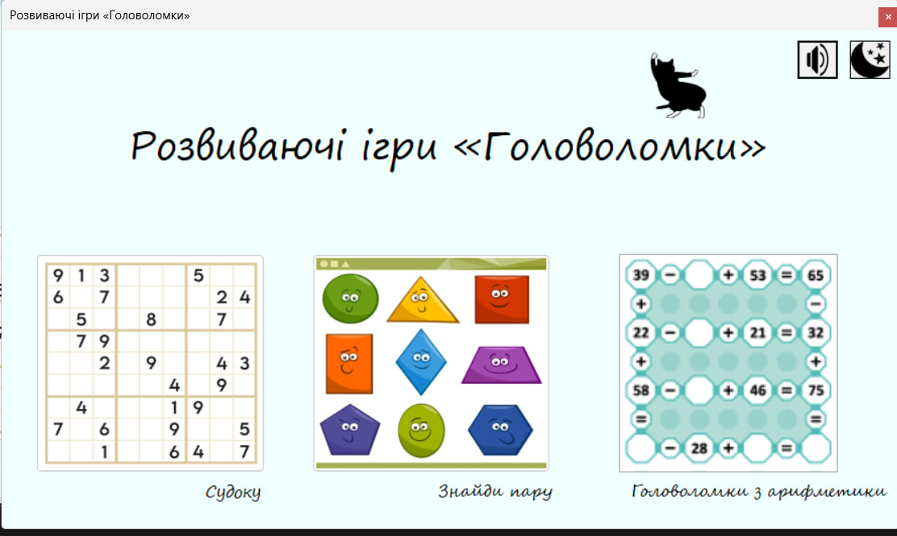
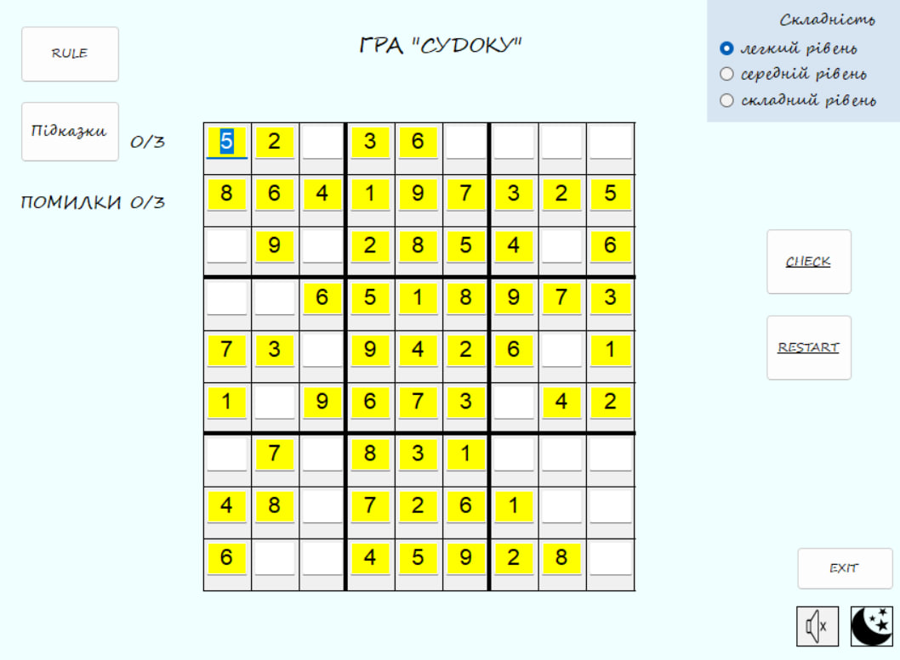
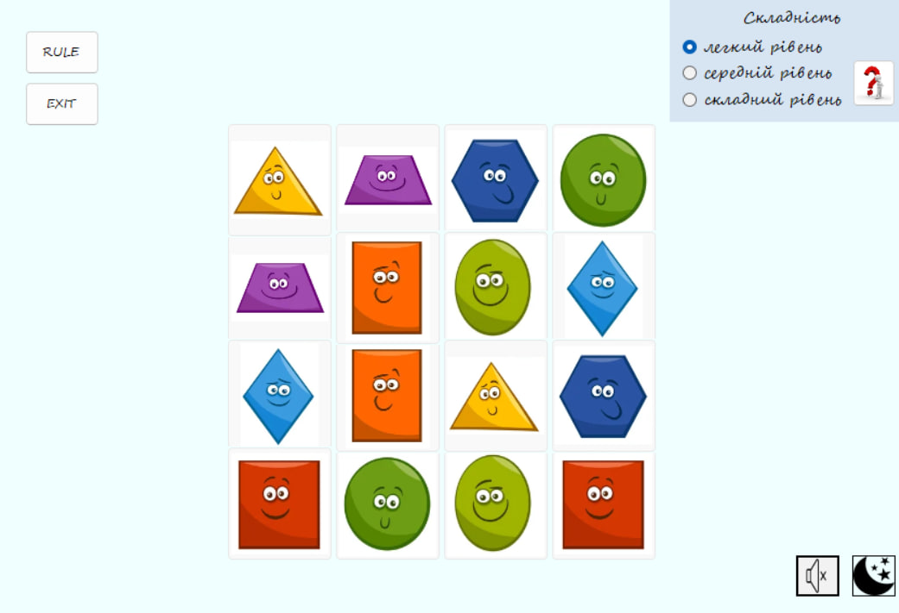
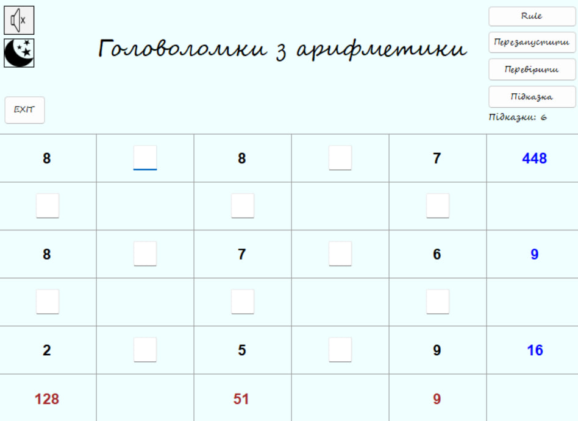

string description = 
"📦 Puzzles — Windows Forms Application, що об’єднує кілька міні-ігор у одному проєкті." + Environment.NewLine +
Environment.NewLine +
"Міні-ігри включають:" + Environment.NewLine +
"  🧮 Arithmetic Puzzle" + Environment.NewLine +
"  🔢 Sudoku" + Environment.NewLine +
"  🃏 Find the Pair (Memory Card Game)" + Environment.NewLine +
"  🎵 Контроль фонової музики" + Environment.NewLine +
"  🌙 Перемикання між світлою та темною темою" + Environment.NewLine +
Environment.NewLine +
"🔹 Головна форма служить навігаційним хабом для всіх міні-ігор." + Environment.NewLine +
Environment.NewLine +
"---" + Environment.NewLine +
Environment.NewLine +
"🔢 Sudoku Game" + Environment.NewLine +
"📌 Опис:" + Environment.NewLine +
"  Повноцінна гра Sudoku 9×9 з:" + Environment.NewLine +
"  - Рівні складності (Easy / Medium / Hard)" + Environment.NewLine +
"  - Відстеження помилок (максимум 3)" + Environment.NewLine +
"  - Система підказок (максимум 3)" + Environment.NewLine +
"  - Валідація введення" + Environment.NewLine +
"  - Кастомне малювання сітки" + Environment.NewLine +
"  - Підтримка звуку та тем" + Environment.NewLine +
Environment.NewLine +
"Game Logic:" + Environment.NewLine +
"- Сітка генерується динамічно." + Environment.NewLine +
"- Попередньо заповнені клітинки:" + Environment.NewLine +
"  - Тільки для читання" + Environment.NewLine +
"  - Підсвічуються жовтим" + Environment.NewLine +
"- Редаговані клітинки:" + Environment.NewLine +
"  - Перевірка введення (1–9)" + Environment.NewLine +
"Підсвітка:" + Environment.NewLine +
"  🟢 Зелений — правильне" + Environment.NewLine +
"  🔴 Червоний — неправильне" + Environment.NewLine +
"  🔵 Синій — підказка" + Environment.NewLine +
Environment.NewLine +
"🧮 Arithmetic Puzzle" + Environment.NewLine +
"📌 Опис:" + Environment.NewLine +
"  Логічна головоломка, де гравці мають відновити пропущені арифметичні оператори (+, -, *, /) у сітці так, щоб:" + Environment.NewLine +
"  - Кожен рядок давав правильний результат" + Environment.NewLine +
"  - Кожен стовпчик давав правильний результат" + Environment.NewLine +
Environment.NewLine +
"🧠 Як це працює:" + Environment.NewLine +
"  - Числа згенеровані заздалегідь" + Environment.NewLine +
"  - Результати рядків: Синій" + Environment.NewLine +
"  - Результати стовпчиків: Коричневий" + Environment.NewLine +
"  - Користувач вводить оператори в порожні клітинки" + Environment.NewLine +
"  - Система перевіряє правильність" + Environment.NewLine +
Environment.NewLine +
"🃏 Find the Pair" + Environment.NewLine +
"  Гра на пам’ять: потрібно знайти однакові пари карток." + Environment.NewLine +
Environment.NewLine +
"🛠 Технології:" + Environment.NewLine +
"    - C#" + Environment.NewLine +
"    - .NET Framework" + Environment.NewLine +
"    - Windows Forms" + Environment.NewLine +
"    - System.Media (SoundPlayer)" + Environment.NewLine +
"    - GDI+ для малювання" + Environment.NewLine +
"    - TableLayoutPanel для динамічних сіток";

